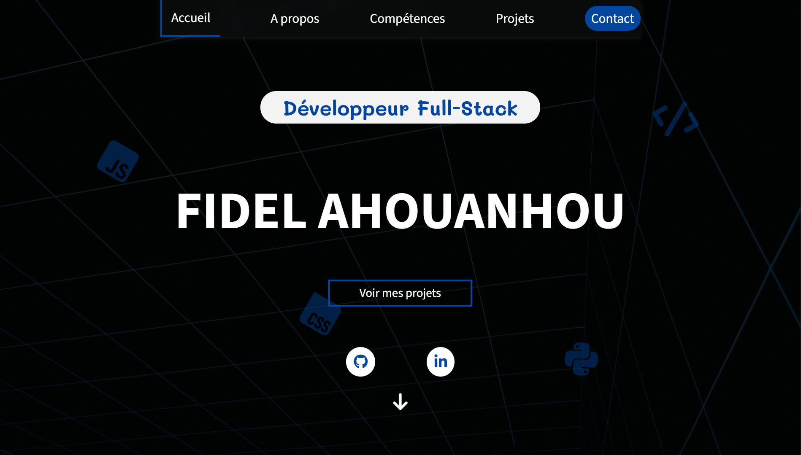

# 🚀 Professional Portfolio – Full Stack Showcase

Projet central servant d’aperçu de mes compétences techniques et de mes réalisations en développement web.  
Il s'agit d’un portfolio interactif responsive présentant mes projets, mes compétences et un système de contact fonctionnel.

🌐 **Visiter le site :**  
https://delprogram.github.io/Portfolio/

---

## 📸 Aperçu du Portfolio



Le portfolio propose :

- une interface moderne et responsive  
- des animations dynamiques au scroll  
- un slider interactif pour les projets  
- un formulaire de contact fonctionnel  
- une navigation fluide entre les sections  

---

## 🎯 Contexte & Objectifs Pédagogiques

Ce projet a été réalisé afin de :

- présenter mes compétences techniques  
- mettre en valeur mes projets personnels et académiques  
- démontrer ma capacité à concevoir une interface web complète  
- implémenter des interactions utilisateur dynamiques en JavaScript  

L’objectif était de produire un site professionnel propre, moderne et performant tout en appliquant de bonnes pratiques de développement.

---

## 🛠️ Stack Technique

### Frontend

- HTML5  
- CSS3  
- JavaScript Vanilla  

### Bibliothèques & services

- EmailJS (gestion des emails depuis le formulaire)  
- FontAwesome (icônes)  
- Google Fonts  

### Techniques utilisées

- CSS Grid & Flexbox  
- Intersection Observer API  
- DOM Manipulation  
- Event Listeners  
- Animations CSS  
- Responsive Design  

---

## ✨ Fonctionnalités Développées

### 1️⃣ Slider interactif des projets

Un carousel dynamique permet de naviguer entre les différents projets.

**Fonctionnalités :**

- navigation avec flèches  
- navigation avec dots (indicateurs)  
- transition fluide avec `transform: translateX()`

**Technologies utilisées :**

- manipulation du DOM  
- EventListeners  
- transitions CSS  

---

### 2️⃣ Animation des compétences au scroll

Les barres de progression des compétences s’animent uniquement lorsque la section devient visible.

**Technique utilisée :**

- Intersection Observer API  

Cela permet :

- d’optimiser les performances  
- d’éviter le chargement inutile des animations  

---

### 3️⃣ Description dynamique des projets

Chaque projet possède un bouton **"Voir plus / Voir moins"**.

**Fonctionnement :**

- affichage dynamique du texte supplémentaire  
- modification du bouton via JavaScript  
- ajustement automatique du layout  

---

### 4️⃣ Formulaire de contact fonctionnel

Le formulaire permet d’envoyer un message directement via email.

**Technologie utilisée :**

- EmailJS  

**Fonctionnalités :**

- récupération des données du formulaire  
- envoi sécurisé via un service externe  
- confirmation utilisateur après envoi  

---

### 5️⃣ Animations visuelles et UI moderne

Plusieurs animations améliorent l’expérience utilisateur :

- floating icons animées  
- effet bounce sur l’icône de scroll  
- transitions CSS sur les cartes de projets  
- hover dynamique sur les images  

---

## 🎨 Interface Utilisateur

Le design repose sur :

- palette de couleurs personnalisée avec variables CSS  
- typographie Google Fonts  
- layout responsive  
- cartes interactives  

**Principes utilisés :**

- lisibilité  
- simplicité  
- hiérarchie visuelle claire  

---

## 📱 Responsive Design

Le site est optimisé pour :

- desktop  
- tablette  
- mobile  

**Techniques utilisées :**

- Media Queries  
- Flexbox  
- adaptation dynamique des sections  

---

## 🧠 Challenges Techniques Résolus

### Gestion des animations conditionnelles

**Problème :**

Les animations des barres de compétences se déclenchaient immédiatement au chargement.

**Solution :**

Utilisation de IntersectionObserver pour déclencher l’animation uniquement lorsque la section devient visible.

---

### Création d’un slider entièrement en JavaScript

**Problème :**

Créer un slider dynamique sans bibliothèque externe.

**Solution :**

- manipulation de `translateX`  
- gestion de l’index courant  
- génération dynamique des dots de navigation  

---

### Envoi d’email sans backend

**Problème :**

GitHub Pages ne permet pas d’utiliser un backend.

**Solution :**

Utilisation de EmailJS pour envoyer les messages directement depuis le frontend.

---

## ⚙️ Installation & Lancement

### Cloner le projet

```bash
git clone https://github.com/Delprogram/Portfolio
```

### Ouvrir le projet

Il suffit d’ouvrir :


dans un navigateur.

---

## 📌 Améliorations Futures

- ajout d’un backend Node.js pour le formulaire
- ajout d’un mode sombre
- optimisation SEO
- ajout d’animations avancées avec GSAP
- migration vers React

---

## 👨‍💻 Auteur

**Fidel Ahouanhou**

Développeur web Full-Stack passionné par la création d'applications web dynamiques et modernes.

**GitHub**  
https://github.com/Delprogram

**LinkedIn**  
https://www.linkedin.com/in/fidel-ahouanhou-687286398/
